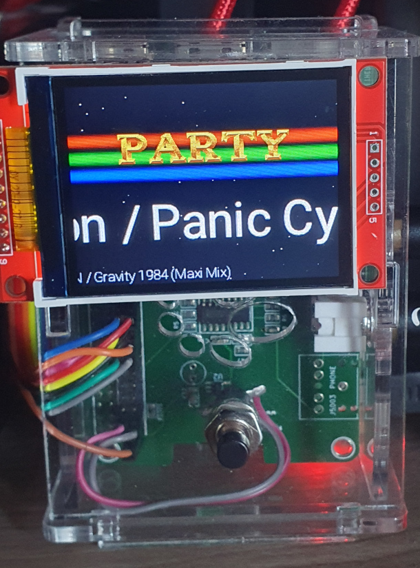

# Party player

Every so often, I host parties at my home for my friends. I like having music when hosting such parties, and I find that DJ's chatting about, commercials and such really annoy me.

As I have a vast music library, why not stream my own music? And since I have an abundance of Raspberry Pi's, why not hook something up to it to make it more interesting?

A photo of the result can be seen below:



It is pretty difficult to do a live capture due to the display/camera-interaction. Suffice to say, the party player shows a logo, three copper bars, a starfield and two scrollers (current track playing and previous track playing) and animates this.

There is a tiny web frontend which allows you to see the current track and skip it - this is intended as 'oh shoot what did I add to the playlist'-measure. It is available by visiting `http://[ip]:8000/` once the party player is running.

## Prerequisites

In order to use this as-is, you need the following:

  * Raspberry Pi 3
  * ILI9341-based TFT display (I used [a 240x320 2.2" one](https://www.tinytronics.nl/shop/nl/displays/tft/2.2-inch-tft-display-240*320-pixels-ili9341))
  * Some wires to connect the display
  * [fbcp-ili9341](https://github.com/juj/fbcp-ili9341) to control the display
  * Music in MP3 format, and a file listing all tracks to play
  * `mplayer` is used for the music playback and must be installed on the Raspberry Pi (`apt install mplayer`)

## Setup

I connected the display as follows:

|Raspberry Pi pin|Raspberry Pi pin description|ILI9341 pin|ILI9341 pin description|
|----------------|----------------------------|-----------|--------------|
|~~16~~ 17|~~GPIO 23~~ +3.3V|8|LED|
|18|GPIO 24|4|RESET|
|19|SPI0 MOSI|6|MOSI|
|21|SPI0 MISO|9|MISO|
|22|GPIO 25|5|DC/RS|
|23|SPI0 CLK|7|SCK|
|24|SPI0 CE0|3|CS|
|2|GND|2|GND|
|1|+3.3V|1|VCC|

Using the Raspberry Pi to drive the backlight did not work at all, I'm assuming the Raspberry Pi can't drive enough current for the backlight to work.

## Build, install and configure fbcp-ili9341

```
# git clone https://github.com/juj/fbcp-ili9341.git
# cd fbcp-ili9341
# mkdir build
# cd build
# cmake -DILI9341=ON -DSPI_BUS_CLOCK_DIVISOR=40 -DGPIO_TFT_DATA_CONTROL=25 -DGPIO_TFT_RESET_PIN=24 -DGPIO_TFT_BACKLIGHT=23 -DSTATISTICS=0 -DDISPLAY_ROTATE_180_DEGREES=ON ..
# make
# cp fbcp-ili9341 /opt/fbcp-ili9341
# cp ../fbcp-ili9341.service /etc/systemd/system
# cp ../fbcp-ili9341.conf /etc
# vi  /etc/systemd/system/fbcp-ili9341.service 
[modify the ExecStart= line to the following]
ExecStart=/opt/fbcp-ili9341
```

I don't want the console to be visible on the framebuffer. To switch that off:

```
# vi /boot/cmdline.txt
[append the following to the single line in there]
fbcon=map:2
```

I want the framebuffer device to have the same dimensions as my display. To chane that:

```
# vi /boot/config.txt
[add the following]
# https://github.com/juj/fbcp-ili9341, Configuring HDMI and TFT display sizes
hdmi_group=2
hdmi_mode=87
hdmi_cvt=320 240 60 1 0 0 0
hdmi_force_hotplug=1
```

Finally, enable the fbcp-ili9341 service:

```
# systemctl daemon-reload
# systemctl enable fbcp-ili9341
```

## Building the party player

You'll need to have `libid3` installed as it is used to read ID3 tags from the MP3 files. To install it:

```
# apt install libid3-3.8.3-dev
```

Now you can build the party player code:

```
# mkdir build
# cd build
# cmake -DCMAKE_BUILD_TYPE=Release ..
# make
```

## Configuring the party player

### NFS mount

I use an NFS mount to avoid having to store all music on the Raspberry Pi. I added the following to `/etc/fstab`:

```
nfs.home.rink.nu:/blue/geluid	/nfs/geluid	nfs	noauto,tcp,x-systemd.automount	0	0
```

This automatically mounts to `/nfs/geluid` without clogging up the boot process. You should add a similar line for your setup.

### Playlist

The file `data/files.txt` needs to contain paths to MP3 files to play. For example:

```
/nfs/geluid/1.mp3
/nfs/geluid/2.mp3
/nfs/geluid/3.mp3
```

This would shuffle and play the files listed above.

### systemd service

There is an example systemd service file included, which runs the party player using a non-privileged user and sets the logging up. You can use it as a starting point for your setup.

```
# cp ../conf/partyplayer.service /etc/systemd/system
# vi  /etc/systemd/system/partyplayer.service 
[change as needed]
```

## Caveats, missing features, nice to haves etc

This was written in a hurry, so there's lots that could be improved. I'd be happy to accept pull requests! To give you some inspiration:

* The ID3 decoding is pretty hit-or-miss, sometimes resulting in weird/corrupt titles (I'm pretty sure I messed up somewhere)
* Decoding/playing the music ourselves would give us more fine-grained control (gapless playback, timestamps, etc)
* The HTTP code is likely not very standards compliant (anyone know of a good library?)
* Visuals are hardcoded in `main.cpp`
* Configuration is hardcoded in `main.cpp`
* No tests at all (CEBTENZZVAT, ZBGURESHPXRE!)

## License

- Party player source code and graphics are licensed using [CC BY 4.0](https://creativecommons.org/licenses/by/4.0/)
- [Roboto](https://fonts.google.com/specimen/Roboto) is licensed using the [Apache License, Version 2.0](http://www.apache.org/licenses/LICENSE-2.0)
- [spdlog](https://github.com/gabime/spdlog) is licensed using the MIT license
- [stb_image](https://github.com/nothings/stb/blob/master/stb_image.h/) and [stb_truetype](https://github.com/nothings/stb/blob/master/stb_truetype.h) are licensed as public domain
- [id3lib](https://id3lib.sourceforge.net/) is licensed using the [GNU Lesser General Public License](https://www.gnu.org/copyleft/lesser.html). Note that this is used as a shared library.